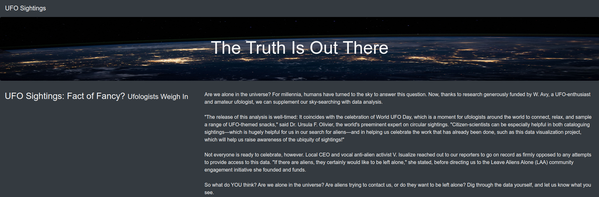
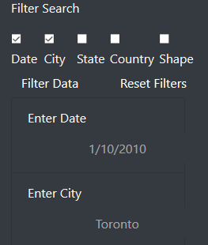
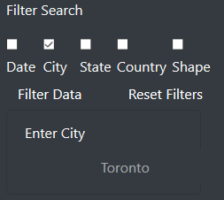
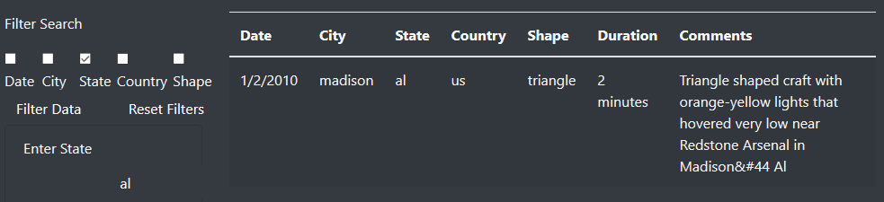
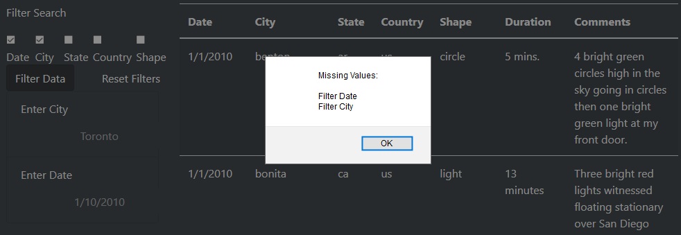
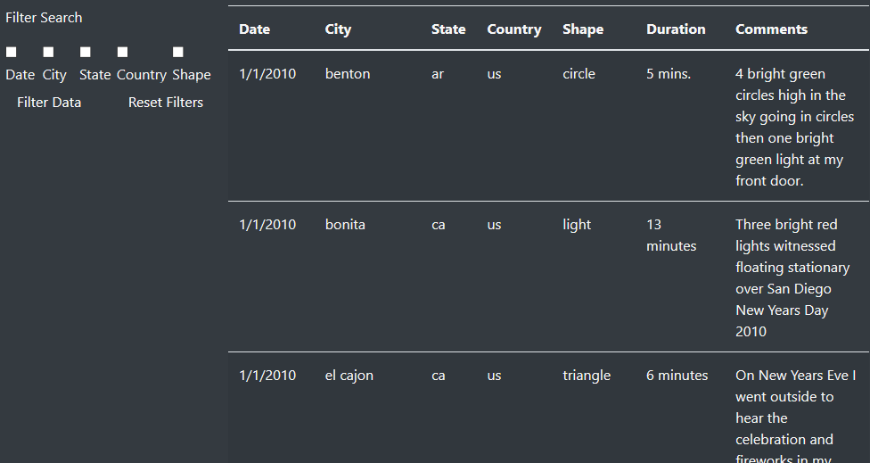

# UFOs

Displaying UFO data with JavaScript

## Live Site

https://selkhayri.github.io/UFO/

## Summary

The purpose of this project was to create a web page which can be used to search through recorded sightings of UFOs. The available information includes the following:

* _Date_
* _City_
* _State_
* _Country_
* _Shape_
* _Duration_
* _Comments_

Of these columns, the project focused on all but the last two columns, namely, _Duration_ and _Comments_.

The functionality that was implemented is as follows:

1. A group of 5 checkboxes were placed across the top row of the filter pane.

    

2. When a checkbox is checked, a text cell appears with the caption, "Enter &lt;field&gt;", as follows:

    

3. When a checkbox is unchecked, the corresponding text cell is removed, as follows:

    

4. When filters are selected and populated, the user clicks "Filter Data" to show the list of UFO events that match the selected criteria.

    

5. If the _Filter Data_ button is clicked but no filters are selected, the entire data set is displayed in the results table.

6. If search fields are displayed but no values are specified, a notice message indicating the missing search values is displayed, as follows:

    

7. If the _Reset Filters_ button is clicked, the table goes back to displaying the entire unfiltered list, the search filter checkboxes are unchecked, and the search fields are removed, as follows:

    

8. To ensure that no inconsistencies occur, the _body onload_ event handler invokes _resetForm_ to ensure that all users have a fresh start every time they load the search site.

9. Since there is no eventuality in which the search form would be submitted, the _submit_ event handler is overridden with a callback function that stops the propagation of the _submit_ event and disables the default behaviour for the search form in the case of a _submit_ event.

### Technologies Used

This project was accomplished using the following technologies:

* The Data-Driven Documents JavaScript library, otherwise known as D3.js, was used for document manipulation, and
* The Bootstrap CSS library for formatting and presentation of the web interface

### Bootstrap Elements

The following Bootstrap elements were used in the implementation of this project:

1. col-xs-, col-sm-, col-md-, col-lg-
2. row
3. container
4. btn, btn-dark

### Recommondation for Further Improvement

As things stand, the user has to type in the values to be searched. Instead of providing text fields to enter the search terms, drop downs could be created using the values in each of the fields to facilitate and expedite the process of filtering the search. In this case, a user would know that a value of interest is not available by simply checking the appropriate drop down and not finding the sought value.
